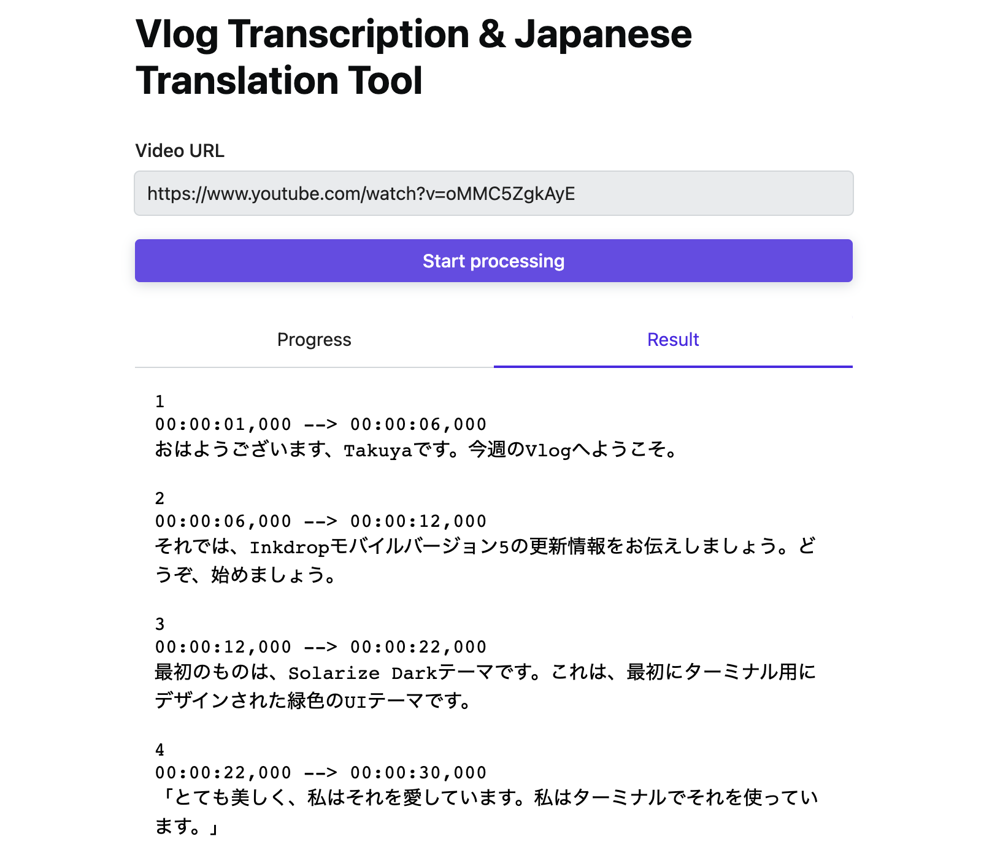
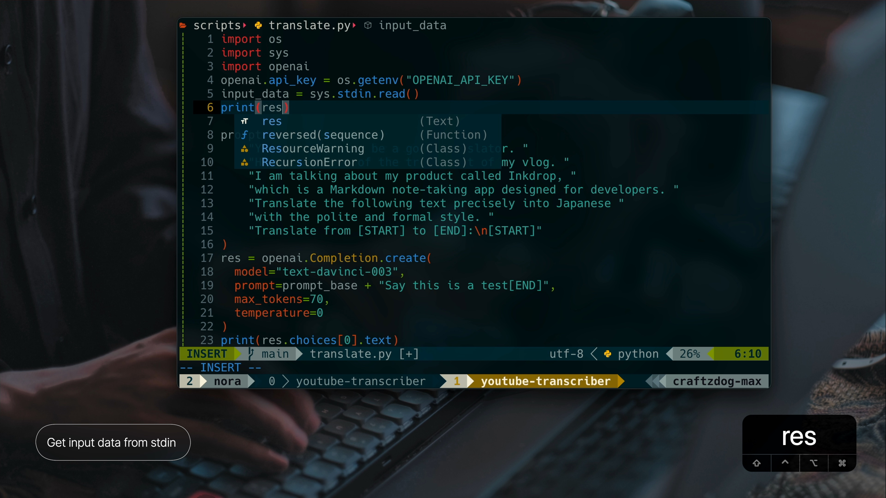

# Vlog Transcription & Japanese Translation Tool

A personal tool for transcribing & translating my vlogs into Japanese.



## Tutorial video

[](https://youtu.be/UNGi144eVbI)

## Ingredients

- Python and [pip](https://pypi.org/project/pip/)
  - [pysrt](https://github.com/byroot/pysrt) - Python parser for SubRip (srt) files
  - [yt-dlp](https://github.com/yt-dlp/yt-dlp) - A youtube-dl fork with additional features and fixes
  - [openai](https://github.com/openai/openai-python) - The OpenAI Python library provides convenient access to the OpenAI API from applications written in the Python language
- Next.js
- [Radix UI](https://www.radix-ui.com/) - Unstyled, accessible components for building high‑quality design systems and web apps in React
- [Stitches](https://github.com/modulz/stitches) - CSS-in-JS Library

## How to use

1. Get your OpenAI API Key [here](https://platform.openai.com/account/api-keys)
2. Set an environment variable `$OPENAI_API_KEY`
3. Run the following commands

```bash
pip install -r requirements.txt
npm i
npm run dev
```

## Project Structure

```
PROJECT_ROOT
├── components    # React components
├── pages         # Pages
│   └── api       # API routes
├── public
├── scripts       # Python scripts
├── tmp           # Temporary files
└── utils         # Utility modules
```

## License

MIT License.

---

Looking for a Markdown note-taking app? Check out my app called Inkdrop:

[](https://www.inkdrop.app/)
